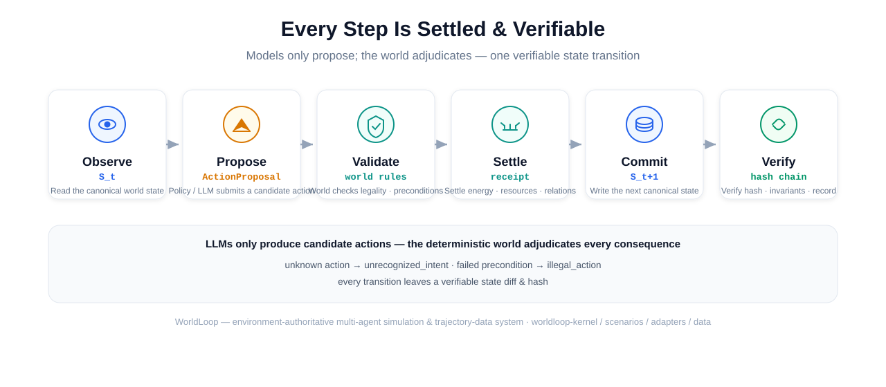
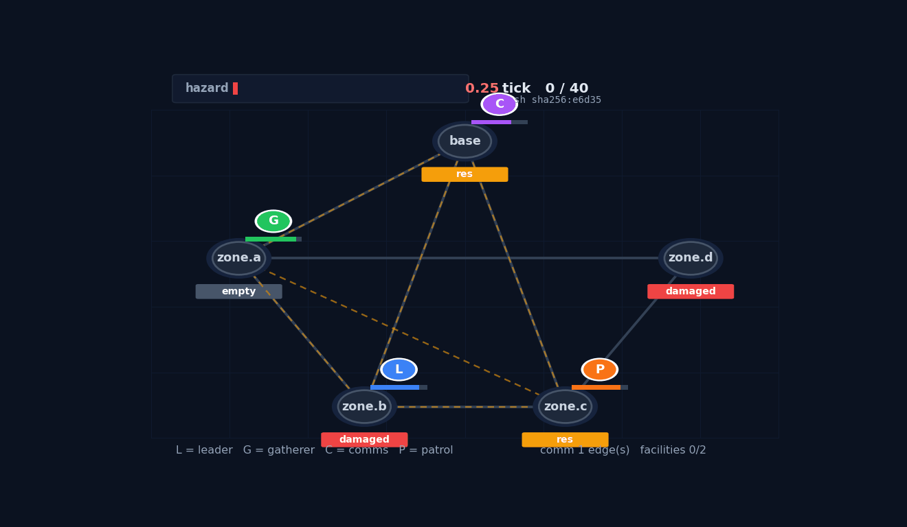

[English](README.md) · [中文](README_zh.md)

<p align="center">
  
  
  
  
  
</p>

# WorldLoop

## A deterministic world where agents propose and rules adjudicate.

Most agent frameworks carry state in the chat history — the model is
proposer, judge, and record-keeper at once. WorldLoop carries state in a
*deterministic world*: a policy or LLM only **submits** candidate actions;
the world performs legality checks, conflict handling, numerical settlement,
and state write-back. Every change is recorded as a verifiable state diff
with a hash chain, so any trajectory can be **replayed, branched, and
compared counterfactually**.

---

## Why a "world"?

For workflow orchestration, chat-history state is fine. For state-transition
research it cannot answer three questions:

1. **What actually happened in the world?** — who proposed what, what
   actually executed, and what was the settlement result.
2. **Can the same start-state be replayed?** — can two runs reproduce
   tick-for-tick?
3. **Can conclusions trace back to evidence?** — can every number be traced
   to one specific transition?

WorldLoop turns these into a protocol:
`observe S_t → propose → world validates & settles → write S_{t+1} →
verify hash & invariants → record / replay / branch / export`.



LLMs cannot directly modify energy, position, resource counts, or life and
death — they only propose, and the world adjudicates.



*Four agents coordinate on a disaster map: **leader** repairs damaged
facilities and pushes the hazard gauge down, **gatherer** collects
resources, **comms** builds the communication network, **patrol** moves
through the zones. Exogenous hazard rises +0.25/tick, REPAIR knocks it back
−0.5, and actions genuinely consume energy. All node state, facility state,
communication edges, and hazard values are settled by the world engine and
written into the state hash.*

Try the interactive version — open `examples/assets/emergency_scheduling.html`
(a self-contained single file: play / scrub in your browser), or run
`python examples/demo/emergency_demo.py` for a terminal animation.

---
## Quick install

Requires Python ≥ 3.10. The packages are not on PyPI yet — install from a
clone (editable installs are recommended for the beta):

```bash
git clone https://github.com/Crqse/worldloop.git
cd worldloop
python -m venv .venv && source .venv/bin/activate   # Windows: .venv\Scripts\activate
python -m pip install -e ./worldloop-kernel -e ./worldloop-scenarios
# optional:
python -m pip install -e "./worldloop-adapters[pettingzoo]"  # external env adapters
python -m pip install -e "./worldloop-data[evaluation]"      # trajectory data pipeline
```

Running the demo (`examples/demo/emergency_demo.py`) only needs
kernel + scenarios; generating the GIF / interactive web demo additionally
needs `matplotlib`, `Pillow`, `numpy`.

## 5-minute quickstart

```python
from worldloop_kernel import ActionProposal, hash_state
from worldloop_scenarios import compile_file

# 1. Compile a scenario: 10x10 grid, 5 agents, forage/rest actions
package = compile_file("examples/discrete_grid.yaml")
world = package.world_factory(seed=42)

# 2. Observe the world
before = world.observe()
print(before.meta.tick, list(before.entities.ids))   # 0 ['e0','e1','e2','e3','e4']

# 3. Policy / LLM submits a candidate action
proposal = ActionProposal(
    agent_id=before.entities.ids[0], action_type="forage",
    params={}, proposed_at_tick=before.meta.tick, proposer="quickstart",
)
executed, receipt = world.validate_action(proposal)
print(receipt.outcome_code, receipt.success)          # ok True

# 4. The world settles it and returns a verifiable transition record
record = world.step(executed)
after = world.observe()
assert record.state_after_hash == hash_state(after)   # hash chain closes
print(after.meta.tick)                                # 1
```

**The world rejects what it doesn't know**: `action_type="fly"` returns
`outcome_code='unrecognized_intent'`, `success=False`, with zero state
change. The environment only executes the rules it declares — an undeclared
boundary constraint is *faithfully executed* rather than silently clamped
(no clamp in `capability`, the world won't add one for you).

---
## What you can actually do with it

Not another chat-history agent framework. WorldLoop is a substrate for
people who need the *trajectory itself* to be trustworthy. Four concrete
jobs it is built for:

1. **Reproduce a multi-agent run tick-for-tick.**
   Seed a world, record every transition into a hash chain, replay the
   exact same start-state on another machine, and assert the two runs
   produce byte-identical state hashes. This turns a simulation claim into
   something a reviewer can re-run, not something you have to trust.

2. **Run real counterfactual experiments on agent behaviour.**
   From one checkpoint, fork the world into branches that differ in a
   single action ("what if the leader agent *repairs* instead of
   *patrols* at tick 5?"), settle both deterministically, and compare the
   resulting states. This is the core primitive behind policy A/B,
   counterfactual data generation, and causal "what mattered" questions.

3. **Generate leakage-checked trajectory datasets for training.**
   Schedule policies (scripted / adversarial / LLM) across seeds, branch
   counterfactually, and export structured episodes with a *leakage
   report* that flags absolute paths, API keys, cache state, and PII in
   prompts — so you know what a downstream model is actually being fed.

4. **Wrap RL environments (PettingZoo / Gymnasium) under the same
   authority contract.**
   Drive an external MARL environment through the same
   propose → validate → settle → record pipeline, so an LLM or policy can
   act in Simple Spread / Simple Tag but can *never* bypass a legality or
   cost rule to write state directly.

If your work is "agents that talk in a loop and print a transcript", you
don't need WorldLoop. If you need to **replay, branch, audit, or
export** what agents did — and to prove the environment, not the model,
was the source of truth — it is aimed at you.

---
## The four packages

| Package | Version | Role | Deps |
|---|---|---|---|
| `worldloop-kernel` | 0.1.3 | state / action / transition / checkpoint / replay / branch / joint-action / protocol | none |
| `worldloop-scenarios` | 0.1.3 | YAML declarative scenario schema, validation, compilation | pyyaml, jsonschema |
| `worldloop-adapters` | 0.1.3 | PettingZoo / Gymnasium / OpenEnv → kernel protocol | optional |
| `worldloop-data` | 0.1.3 | policy pool / rollout / counterfactual / coverage / leakage / export / LLM policy / eval | optional |

Dependency direction is fixed: `kernel ← scenarios`, `kernel ← adapters`,
`kernel + scenarios ← data`. The four packages do not depend on the five-layer
native world (`current/worldloop/` is an earlier v1 implementation).

### Feature highlights (as of v0.1.3)

**kernel** — ActionProposal / ExecutedAction / ActionReceipt end-to-end,
canonical serialization, Diff/Apply, state hash chain, invariant checks and
quarantine, checkpoint/restore, deterministic replay, counterfactual branch,
joint action, capability declaration.

**scenarios** — `ScenarioSpec v0` schema (time / space / field / entities /
relations / registries / actions / exogenous / termination), YAML
compilation, schema validation, parameterized world factory, example
scenarios (grid, continuous field, node graph, market, emergency
scheduling), plus the `examples/demo/` four-role policy demo and
`examples/assets/` visual assets (architecture SVG, animated GIF,
interactive web demo).

**adapters** — PettingZoo Parallel, Gymnasium, OpenEnv → kernel protocol,
with action mapping, state mapping, checkpoint mapping and capability
declaration; only environments that can save & restore full state + RNG may
declare exact restore.

**data** — policy pool (scripted / adversarial / LLM), rollout scheduling,
coverage scheduling, `KernelBranchScheduler` counterfactual branching,
leakage checks (absolute paths / API keys / cache / PII), dataset export
(train/val/test split + manifest + checksums), `LLMPolicy` real-model wiring
(prompt contract + telemetry + fail-closed), evaluation suite (action
ranking, baselines, treatment comparison).

---
## Evidence & boundaries (claims source: `docs/CLAIMS.md`)

- **Deterministic replay & counterfactual branch**: on exact-restore
  environments (MPE2 Simple Spread / Simple Tag), all branches pass; any
  environment's exact restore must be declared via capability.
- **Counterfactual data value**: the M8 evidence is a **negative result** —
  matched counterfactual data did not improve ranking accuracy (CI excludes
  zero). The project does **not** claim "counterfactual data is always useful".
- **Quality gates**: all 10 (Q0–Q9) reach mechanical-verification level;
  Q9 is outcome-utility.
- **Not claimed**: open-ended evolution, digital life, real-world social
  simulation, real-world prediction.

## Roadmap

- v0.2 — scenario mechanics expansion (local field effects, metabolism /
  death), built-in renderer, more example scenarios
- v0.3 — data-export schema stabilization + a `worldloop run` CLI

## Contributing & feedback

Contributions welcome — writing a YAML scenario is the fastest on-ramp, see
`examples/` and `examples/quickstart.ipynb`.

- Scenarios: `examples/*.yaml`
- Notebook: `examples/quickstart.ipynb`
- Issues & feedback: GitHub Issues
- This project openly reports negative results (the counterfactual
  no-gain configuration & statistics), see the release docs and the
  counterfactual-branch demo in `examples/quickstart.ipynb`.

## Author

- 冯福 (Fu Feng), aka **cqq** — GitHub [@Crqse](https://github.com/Crqse) ·
  <1148395497@qq.com>

Feedback, bug reports, and scenario YAML contributions are welcome via
GitHub Issues.

## License

MIT — all four packages. See each package's `LICENSE`.
