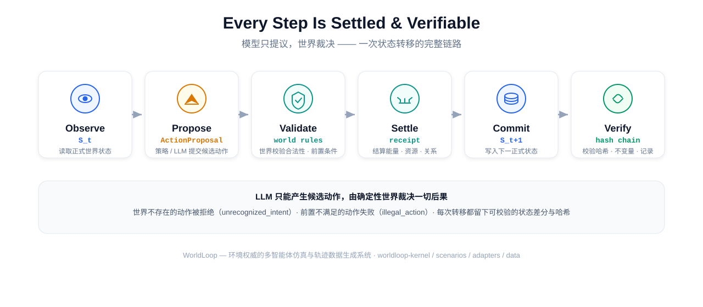

[English](README.md) · [中文](README_zh.md)

<p align="center">
  
  
  
  
  
</p>

# WorldLoop

**让 LLM 与 Agent 只做提议，由确定性世界裁决一切后果。**

WorldLoop 是一个环境权威的多智能体仿真与轨迹数据生成系统。大模型或其他
策略只提交候选动作；世界负责合法性检查、冲突处理、数值结算和状态写入。
每一次变化都被记录为可校验的状态差分与哈希，因此任何轨迹都可以被**重放、
分支和反事实比较**。

---

## 为什么需要"世界"？

主流 Agent 框架用消息历史承载状态，模型同时参与决策、解释与结果判断。
这对流程编排够用，但对状态转移研究有三个回答不了的问题：

1. **世界到底发生了什么？** —— 谁提议了什么、实际执行了什么、结算结果是什么
2. **同一起点能否重放？** —— 两次运行能否逐 tick 复现
3. **结论能否回到证据？** —— 每个数字能否追溯到一次具体转移

WorldLoop 把这三件事做成协议：观察 `S_t` → 策略提交候选动作 → 世界校验并
结算 → 写 `S_{t+1}` → 校验哈希与不变量 → 记录、重放、分支或导出。



LLM 不能直接修改能量、位置、资源数量或生死——它只提交提议，由世界裁决。


*四名 agent 在灾害图上协作：**leader** 修复受损设施并压制威胁、**gatherer**
采集资源、**comms** 建立通信网、**patrol** 在区域间巡逻。外生威胁每 tick +0.25，
REPAIR 每次 −0.5，动作真实消耗能量。所有节点状态、设施状态、通信边、威胁值
均由世界引擎结算并写入状态哈希。*

想看交互版？打开 `examples/assets/emergency_scheduling.html`（自包含单文件，
浏览器打开即可播放 / 拖动时间轴回放），或运行
`python examples/demo/emergency_demo.py` 看终端 ASCII 动画。

---
## 快速安装

要求 Python ≥ 3.10。

**从 PyPI（发布后）：**

```bash
python -m venv .venv && source .venv/bin/activate
pip install worldloop-kernel worldloop-scenarios
# 可选
pip install "worldloop-adapters[pettingzoo]"        # 外部环境适配
pip install "worldloop-data[evaluation,external]"   # 轨迹数据流水线
```

**从源码构建（发布前 / 想跑 examples）：**

```bash
python -m venv .venv && source .venv/bin/activate
pip install ./worldloop-kernel
pip install "./worldloop-adapters[pettingzoo]"      # 可选
pip install ./worldloop-scenarios
pip install "./worldloop-data[evaluation,external]" # 可选
```

运行演示（`examples/demo/emergency_demo.py`）只需 kernel + scenarios；
生成 GIF / 交互式 Web demo 额外需要 `matplotlib`、`Pillow`、`numpy`。

## 5 分钟上手

```python
from worldloop_kernel import ActionProposal, hash_state
from worldloop_scenarios import compile_file

# 1. 编译一个场景：10x10 网格世界，5 个 agent，forage/rest 两种动作
package = compile_file("examples/discrete_grid.yaml")
world = package.world_factory(seed=42)

# 2. 观察世界
before = world.observe()
print(before.meta.tick, list(before.entities.ids))   # 0 ['e0','e1','e2','e3','e4']

# 3. 策略/LLM 提交候选动作
proposal = ActionProposal(
    agent_id=before.entities.ids[0], action_type="forage",
    params={}, proposed_at_tick=before.meta.tick, proposer="quickstart",
)
executed, receipt = world.validate_action(proposal)
print(receipt.outcome_code, receipt.success)          # ok True

# 4. 世界结算，返回可校验的转移记录
record = world.step(executed)
after = world.observe()
assert record.state_after_hash == hash_state(after)   # 哈希链闭合
print(after.meta.tick)                                # 1
```

**世界会拒绝它不认识的提议**：`action_type="fly"` 返回
`outcome_code='unrecognized_intent'`、`success=False`、状态零变化。
环境只执行它声明的规则——这也意味着**未声明边界约束的越界移动会被如实执行**
（`capability` 声明里没有 clamp，世界就不替你补）。

---
## 四个包

| 包 | 版本 | 职责 | 依赖 |
|---|---|---|---|
| `worldloop-kernel` | 0.1.3 | 状态/动作/转移/checkpoint/重放/分支/联合动作/协议 | 无 |
| `worldloop-scenarios` | 0.1.3 | YAML 声明式场景 schema、校验、编译 | pyyaml, jsonschema |
| `worldloop-adapters` | 0.1.3 | PettingZoo / Gymnasium / OpenEnv → 内核协议 | 可选 |
| `worldloop-data` | 0.1.3 | 策略池/rollout/反事实/覆盖率/泄漏检查/导出/LLM 策略/评估 | 可选 |

依赖方向固定：`kernel ← scenarios`、`kernel ← adapters`、`kernel+scenarios ← data`。
四个包不依赖五层原生世界（`current/worldloop/` 是 v1 的独立实现）。

### 功能清单（v0.1.3 实证）

**kernel**：ActionProposal/ExecutedAction/ActionReceipt 全链路、canonical 序列化、
Diff/Apply、状态哈希链、invariant 检查与 quarantine、Checkpoint/restore、
确定性重放、反事实分支、JointAction 联合动作、能力声明（capability）。

**scenarios**：`ScenarioSpec v0` schema（时间/空间/场/实体/关系/注册表/动作/
外生/终止）、YAML 编译、schema 校验、参数化世界工厂、内置示例场景
（网格/连续场/节点图/市场/应急调度），外加 `examples/demo/` 四角色策略演示
与 `examples/assets/` 可视化资产（架构图 SVG、动画 GIF、交互式 Web demo）。

**adapters**：PettingZoo Parallel、Gymnasium、OpenEnv 三套环境 → 内核协议，
含动作映射、状态映射、checkpoint 映射与能力声明；只有支持完整状态+RNN 保存
恢复的环境才能声明 exact restore。

**data**：策略池（scripted/adversarial/LLM）、rollout 调度、覆盖率调度、
KernelBranchScheduler 反事实分支、泄漏检查（绝对路径/API key/缓存/PII）、
数据集导出（train/val/test 划分 + manifest + checksums）、LLMPolicy 真实模型
接入（prompt contract + telemetry + fail-closed）、评估套件（action ranking、
baselines、treatment comparison）。

---
## 证据与边界（对外主张的唯一来源为 `docs/CLAIMS.md`）

- 确定性重放与反事实分支：支持精确恢复的环境在 MPE2 Simple Spread/Simple Tag
  上全通过；任意环境的 exact restore 需声明 capability。
- 反事实数据价值：当前 M8 证据为**负结果**（matched counterfactual 未带来
  排序准确率增益，CI 排除零）。项目不主张"反事实数据必然有用"。
- 质量门：10 项（Q0-Q9）均达机械验证档；Q9 为 outcome utility。
- 当前不主张：开放式演化、数字生命、真实社会模拟、真实世界预测。

## 路线图

- v0.2：场景机制扩展（局部场效应、代谢/死亡）、内置渲染器、更多示例场景
- v0.3：数据导出 schema 稳定 + CLI 工具 `worldloop run`

## 贡献与反馈

Contributions welcome —— 从「写一个 YAML 场景」开始是最快上手方式：

- 场景：`examples/*.yaml`
- Notebook：`examples/quickstart.ipynb`
- 反馈与问题：GitHub Issues
- 本项目公开报告真实负结果（反事实数据未带来训练增益的配置与统计），
  见发布文档与 `examples/quickstart.ipynb` 的反事实分支演示。

## 作者

- 冯福，昵称 **cqq** — GitHub [@Crqse](https://github.com/Crqse) ·
  <1148395497@qq.com>
- **付费集成 / 技术支持 / 定制开发** —— 联系 <1148395497@qq.com>。
  MIT 本身即允许商用；该渠道专门承接 **付费集成、技术支持订阅与定制开发**。

## License

MIT — 四个包均为 MIT License。详情见各包 `LICENSE` 文件。
